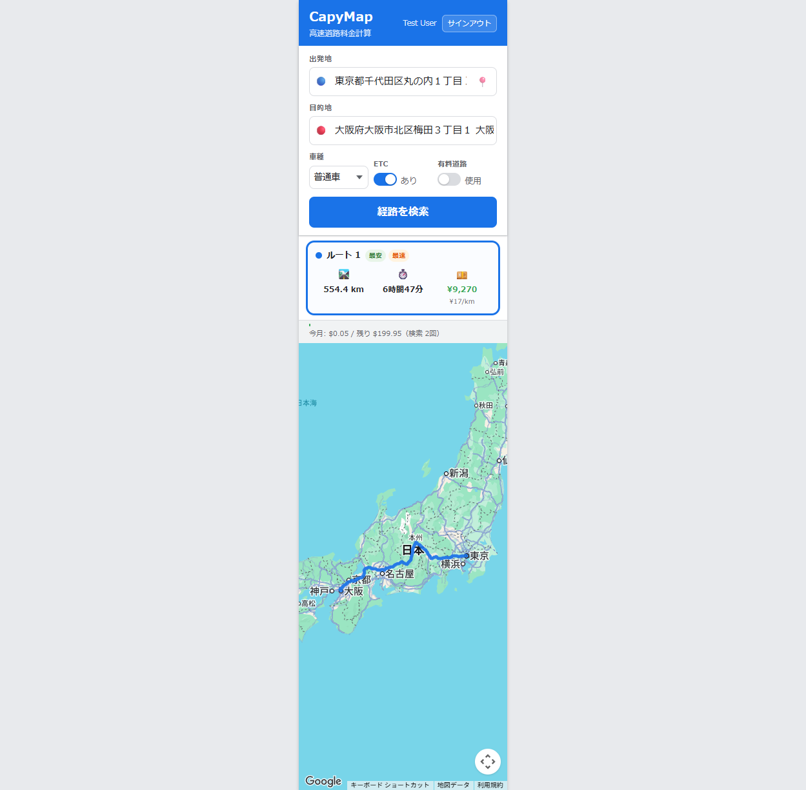

# CASE-001: 複数ルート比較表示

**テスト日**: 2026-05-28  
**テスト者**: Playwright 自動テスト  
**URL**: https://chunkangyang.github.io/CapyMap/?t=7

## テスト手順
1. セッション注入（cky1983@gmail.com）
2. 出発地: 東京駅（Places Autocomplete で選択）
3. 目的地: 大阪駅（Places Autocomplete で選択）
4. 車種: 普通車、ETC: あり、有料道路: 使用
5. 「経路を検索」クリック

## 結果
| 項目 | 値 |
|------|-----|
| ルート数 | 1（Google Routes API が返す代替数に依存） |
| 距離 | 554.4 km |
| 所要時間 | 6時間47分 |
| 通行料金 | ¥9,270 |
| ¥/km | ¥17/km |
| 最安バッジ | ✅ 表示 |
| 最速バッジ | ✅ 表示 |
| 地図経路描画 | ✅ 正常 |
| 月次使用量更新 | ✅ $0.05 / 残り $199.95 |

## スクリーンショット

## 判定
✅ PASS
