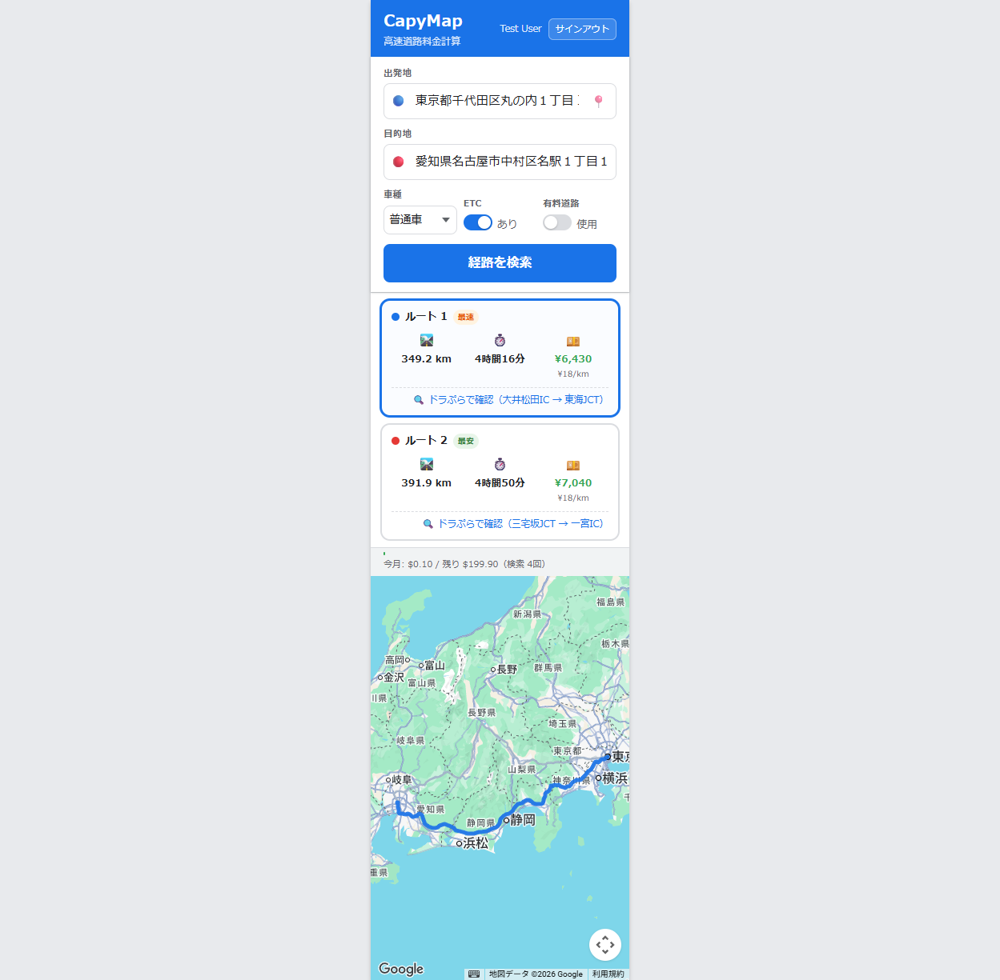

# CASE-002: ドラぷら確認リンク（IC抽出）

**テスト日**: 2026-05-28  
**テスト者**: Playwright 自動テスト  
**URL**: https://chunkangyang.github.io/CapyMap/?t=9

## テスト手順
1. セッション注入（cky1983@gmail.com）
2. 出発地: 東京駅、目的地: 名古屋駅
3. 車種: 普通車、ETC: あり、有料道路: 使用
4. 「経路を検索」クリック

## 結果
| 項目 | 値 |
|------|-----|
| ルート数 | 2（最速・最安） |
| ルート1 verify link | ✅ ドラぷらで確認（大井松田IC → 東海JCT） |
| ルート2 verify link | ✅ ドラぷらで確認（三宅坂JCT → 一宮IC） |
| URL 形式 | `https://www.driveplaza.com/dp/SearchTop?sName=...&dName=...&way=1&car_type=1&etc_use=1` |
| リンク新規タブ開く | ✅ target="_blank" |
| カード選択阻害なし | ✅ event.stopPropagation() で対応 |

## 生成されたURL例
- ルート1: `https://www.driveplaza.com/dp/SearchTop?sName=%E5%A4%A7%E4%BA%95%E6%9D%BE%E7%94%B0IC&dName=%E6%9D%B1%E6%B5%B7JCT&way=1&car_type=1&etc_use=1`
- ルート2: `https://www.driveplaza.com/dp/SearchTop?sName=%E4%B8%89%E5%AE%85%E5%9D%82JCT&dName=%E4%B8%80%E5%AE%AEIC&way=1&car_type=1&etc_use=1`

## スクリーンショット

## 判定
✅ PASS
