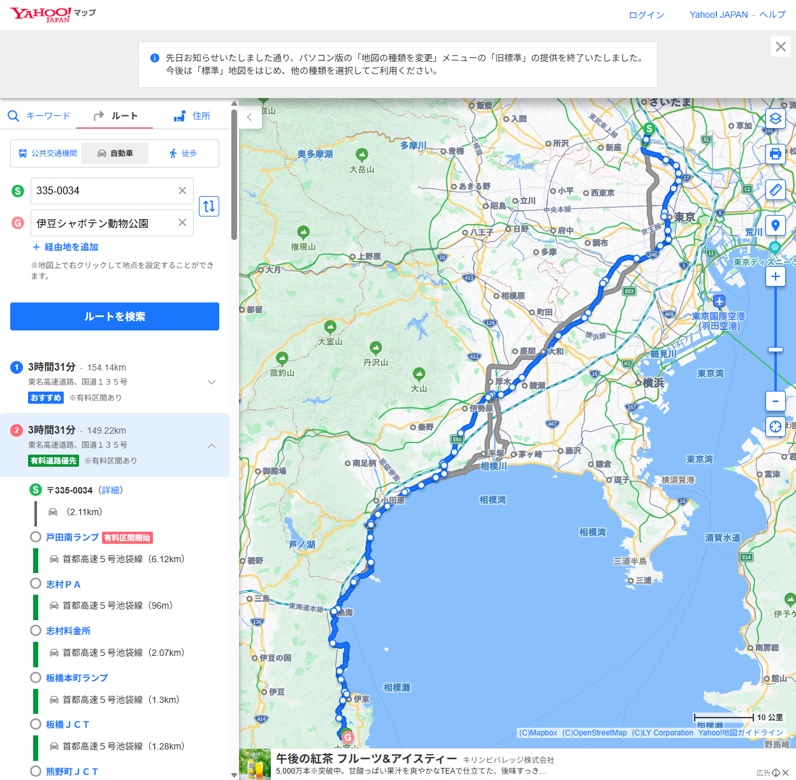

# CASE-002: Yahoo!マップ確認リンク（住所テキスト）

**テスト日**: 2026-05-28  
**テスト者**: Playwright 自動テスト  
**URL**: https://chunkangyang.github.io/CapyMap/index.html?bust=1

## テスト手順
1. セッション注入（cky1983@gmail.com）
2. 出発地: 335-0034、目的地: 伊豆シャボテン動物公園
3. 車種: 普通車、ETC: あり、有料道路: 使用
4. 「経路を検索」クリック

## 結果
| 項目 | 値 |
|------|-----|
| ルート数 | 3 |
| verify link URL 形式 | `https://map.yahoo.co.jp/route/car?from=<住所>&to=<住所>` |
| Yahoo!マップ ページタイトル | ✅ 335-0034から伊豆シャボテン動物公園の自動車ルート - Yahoo!マップ |
| ルート自動検索 | ✅ 開くと即ルート表示（以前の座標指定は「ルートは見つかりません」） |
| リンク新規タブ開く | ✅ target="_blank" |
| カード選択阻害なし | ✅ event.stopPropagation() で対応 |

## 生成されたURL例
`https://map.yahoo.co.jp/route/car?from=335-0034&to=%E4%BC%8A%E8%B1%86%E3%82%B7%E3%83%A3%E3%83%9C%E3%83%86%E3%83%B3%E5%8B%95%E7%89%A9%E5%85%AC%E5%9C%92`

## 変更履歴
- v=6 以前: ドラぷら IC 名 deep-link → 「そのような交流道はない」でNG
- v=6: Yahoo!マップ 座標指定 → 「ルートは見つかりません」でNG  
- **v=7: Yahoo!マップ 住所テキスト → ✅ PASS**

## スクリーンショット

## 判定
✅ PASS
